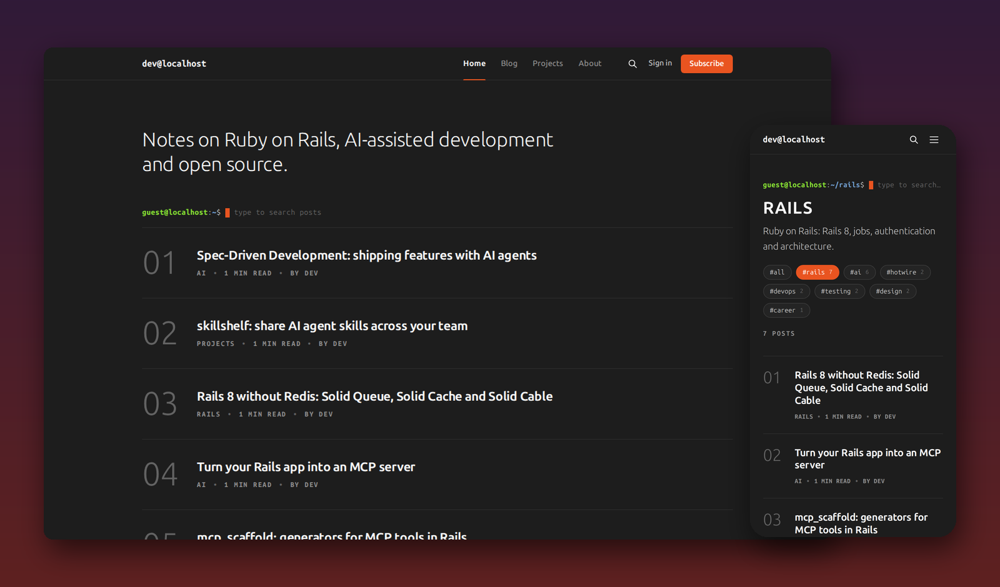
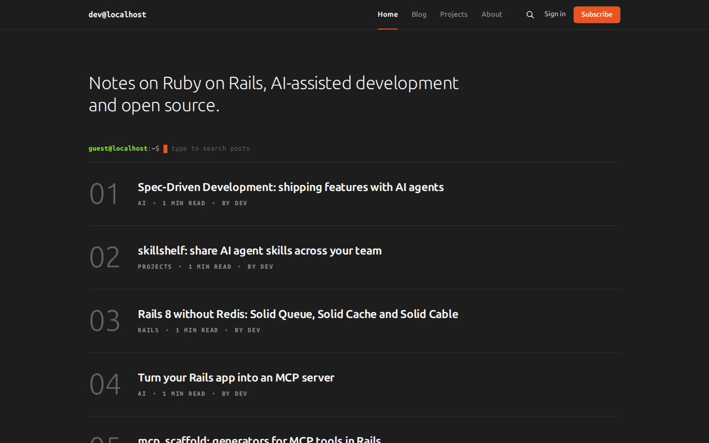
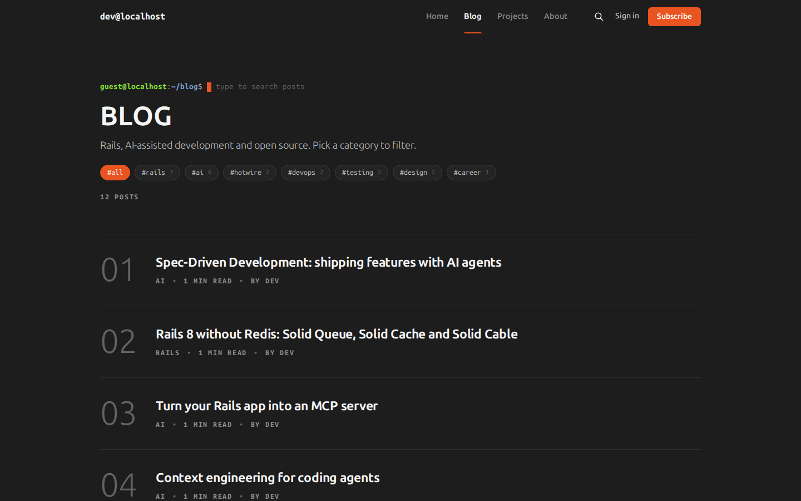
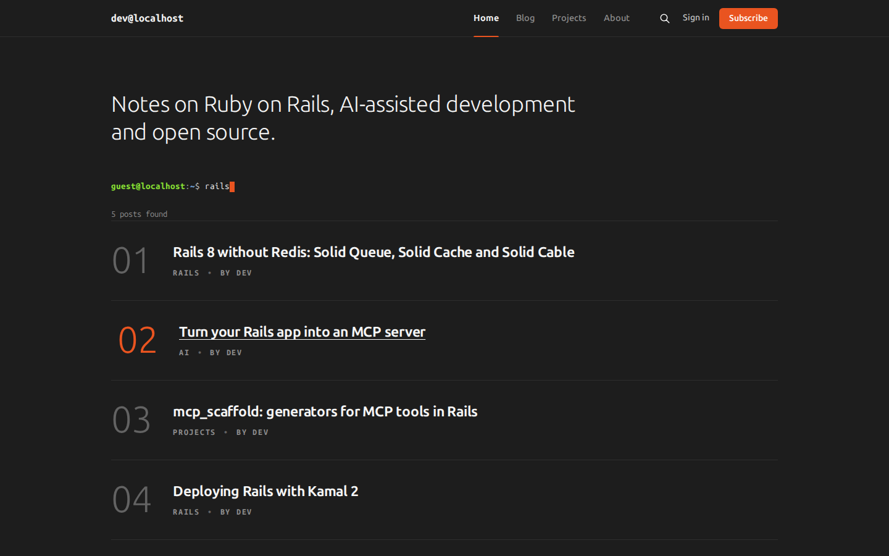
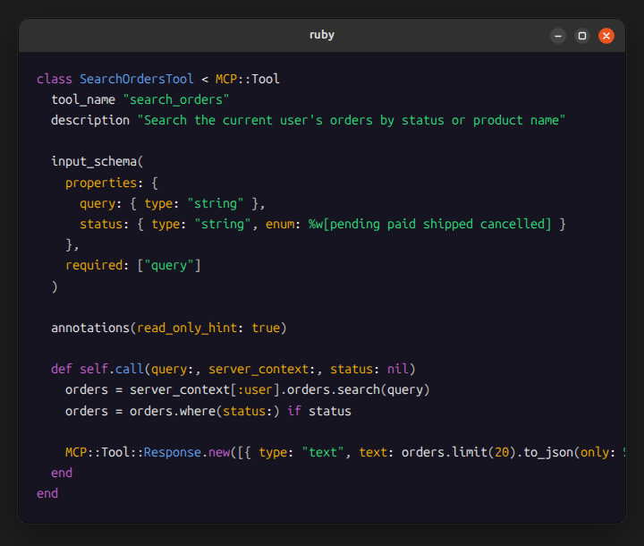
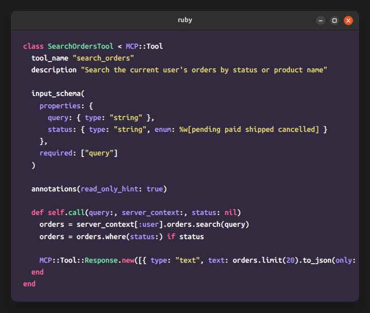
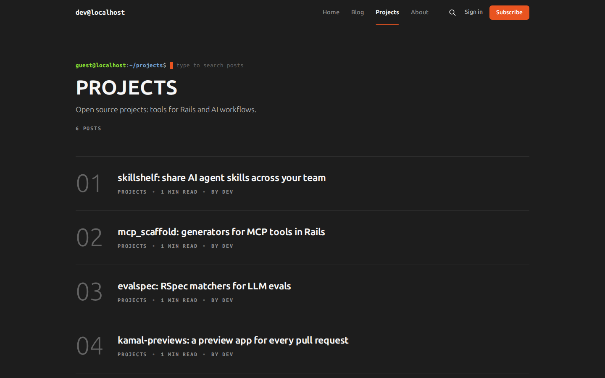
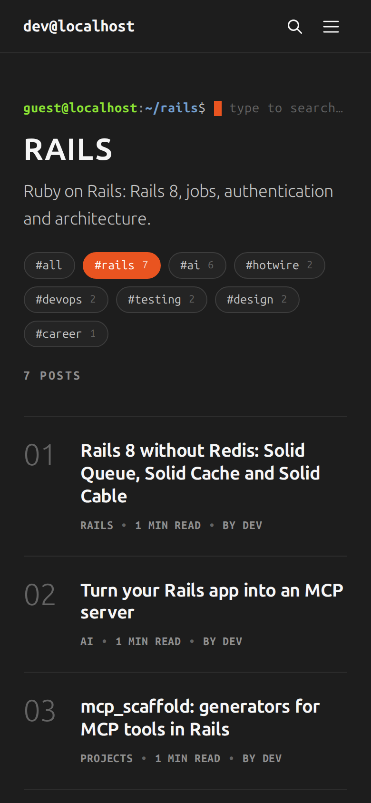
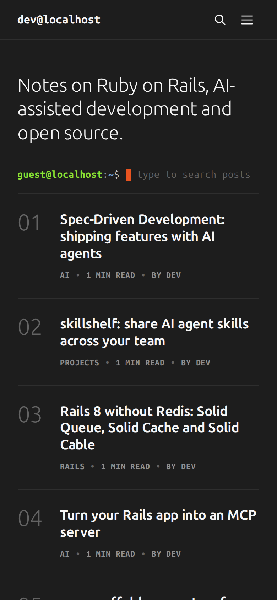

# Yaru

A clean, minimal dark theme inspired by Ubuntu 24.04 (Yaru dark).

A theme for [Ghost](https://ghost.org) (≥ 5.0), based on the official [Source](https://github.com/TryGhost/Source) theme (MIT).



## Features

- **Terminal prompt search**: type after `guest@localhost:~$` to filter posts by title, with a blinking orange cursor (`/` to focus, `Enter` to open, `Esc` to clear).
- **GTK-style navigation**: Yaru tabs with an orange accent on the current item and on hover.
- **Code blocks as GNOME windows**, with Prism.js syntax highlighting in two palettes: Ubuntu terminal or ray.so.
- **Blog with category pills**: a `/blog/` page and `#tag` pills to filter by category.
- **Projects portfolio**: a tag that works as a portfolio, kept out of the blog list.
- **Numbered post list** with a smooth slide on hover.
- **Members and newsletter** ready, with Bluesky, LinkedIn and GitHub links in the footer.
- **English and Brazilian Portuguese**, 19 options in Ghost Admin and no code changes needed.

## Screenshots

| Home | Blog with category pills |
|---|---|
|  |  |
| **Search in the prompt** | **Post** |
|  |  |
| **Code: Yaru palette** | **Code: Ray.so palette** |
|  |  |
| **Projects** | **Mobile** |
|  |   |

## Installation

1. Download `dist/yaru.zip` (or build it with `npm run zip`).
2. In Ghost Admin: **Settings → Design & branding → Customize → Change theme → Upload theme**.
3. Activate the theme and adjust the options in **Design & branding → Customize**.
4. Upload this repository's `routes.yaml` in **Settings → Labs → Routes → Upload routes file**. It creates the `/blog/` page (`blog.hbs` template): every post except the ones in the projects tag, with pagination and the category pills.
5. Optional: create a page with the `blog` slug. Its title and excerpt become the title and description of `/blog/`.

## Theme options (Design & branding)

| Option | Type | Group | Default | What it does |
|---|---|---|---|---|
| `terminal_prompt` | text | Site-wide | `guest@localhost` | user@host of the terminal prompt (home, breadcrumb, tag, author, 404). Empty = just `~$` |
| `projects_tag` | text | Site-wide | `projects` | Slug of the portfolio tag. Its posts are left out of `/blog/` and it doesn't show up in the pills. If you change it, change the filter in `routes.yaml` too |
| `prompt_search` | boolean | Site-wide | on | Title search in the prompt on the home, tag and author pages: visitors type after the `$` and the list is filtered (`/` focuses it, `Enter` opens the first result, `Esc` clears it). On tag and author pages, it only searches their posts. When off, the prompt shows `ls` again |
| `show_blinking_cursor` | boolean | Site-wide | on | Blinking orange cursor in the search prompt |
| `signup_heading` | text | Site-wide | — | Heading of the newsletter block (end of posts and footer); default: site title |
| `signup_subheading` | text | Site-wide | — | Text of the newsletter block; default: site description |
| `github_url` | text | Site-wide | — | Link to your GitHub profile. The icon shows up in the footer, after Ghost's social accounts (Ghost has no GitHub field) |
| `show_home_intro` | boolean | Homepage | on | Large intro sentence at the top of the home page |
| `home_intro_text` | text | Homepage | — | The intro sentence; default: site description |
| `show_post_numbers` | boolean | Homepage | on | 01, 02… numbering in the post list |
| `show_author` | boolean | Homepage | on | "BY AUTHOR" in the list metadata |
| `show_reading_time` | boolean | Homepage | on | Reading time in the list |
| `show_publish_date` | boolean | Homepage | off | Publish date in the list |
| `show_breadcrumb` | boolean | Post | on | Prompt-style breadcrumb at the top of posts and pages |
| `code_blocks_as_windows` | boolean | Post | on | Code blocks as GNOME windows (headerbar with the language + window buttons) |
| `code_style` | select | Post | `Yaru` | How code looks: `Yaru` (GNOME window, Ubuntu terminal colors) or `Ray.so` (the same GNOME window, with a purple background and ray.so colors) |
| `syntax_highlighting` | boolean | Post | on | Syntax colors in code blocks (Prism.js). Languages are listed in `PRISM_LANGUAGES` in `gulpfile.js` |
| `show_post_signup` | boolean | Post | on | Newsletter block at the end of posts (on posts, the footer doesn't repeat the form) |
| `show_related_articles` | boolean | Post | on | "Read next": 3 numbered posts that share tags with the current one |


## Recommended Ghost Admin setup

- **Accent color** (Design & branding → Brand): `#E95420` (Ubuntu orange). It colors the active tab, buttons, the cursor, links and focus.
- **Primary navigation** (Settings → Navigation): a few short items, e.g. Home `/`, Blog `/blog/`, Projects `/tag/projects/`, About `/about/`. Categories live in the pills on `/blog/` and the tag pages, not in the menu. The current page gets the orange bar; items that don't fit go into the `⋮` menu.
- **Social accounts** (Settings → General → Social accounts): filled-in accounts show up as icons in the footer (e.g. Bluesky and LinkedIn). GitHub comes from the theme's `github_url` option.
- **Secondary navigation**: footer links (About, Uses, Contact, RSS, Subscribe → `#/portal/signup`).
- **Site description**: shown as the home page intro and in the footer.
- **Logo**: optional. Without one, the title is set in Ubuntu Sans Mono, exactly as written (e.g. `dev@localhost`).
- **Language** (Settings → General → Publication language): the theme ships with English (`en`) and Brazilian Portuguese (`pt-BR`). Translations live in `locales-local/`.
- **Tags**: the primary tag shows up in the metadata and the breadcrumb (`~/tag-slug$`); related posts use shared tags. On `/blog/` and the tag pages, public tags with posts show up as `#slug` pills (from most to fewest posts), with the current one in orange.
- **Members/newsletter**: with members enabled, Sign in/Subscribe show up in the header along with the newsletter block. Turn members off to hide them.
- **Posts per page**: 5 (`config.posts_per_page` in `package.json`), with "← Newer posts · N / M · Older posts →" links. Numbering continues across pages via JS.
- **Fonts**: Ubuntu Sans and Ubuntu Sans Mono (SIL OFL), served by the theme. If you pick fonts in Design & branding → Typography, they replace Ubuntu Sans.


## Style guide and example content

`docs/style-guide.html` is the content of a "Yaru theme style guide" post: palette, typography, lists, quotes, code windows, images, editor cards and every theme option. `docs/preview-seed.json` is the `dev@localhost` example site: a developer blog about AI-assisted development (Spec-Driven Development, context engineering, MCP, evals, prompt caching) and Rails 8 (Solid Queue, Kamal 2, authentication, Active Job Continuations, Turbo morphing), plus a portfolio of fictional open source projects (`Projects` tag, at `/tag/projects/`). It has 17 posts, the About, Uses and Contact pages, and the style guide (`style-guide` slug). The body of each post and page lives in `docs/content/*.html`.

To publish one of them on an existing Ghost site, create the post through the Admin API with `?source=html` (`POST /ghost/api/admin/posts/?source=html`), which turns the HTML into native editor cards. Replace the `{{img}}` placeholders with image URLs first. HTML import doesn't create the alternative quote: after importing, select the second block in the "Quotes" section and click the quote button twice. The `docs/` folder isn't included in the theme `.zip`.


## Development

```bash
npm install
npm run dev      # gulp: build + watch with livereload
npm run build    # builds assets/built/
npm test         # gscan
npm run zip      # dist/yaru.zip
```

Structure:

- `default.hbs` — base layout (head, navigation, footer)
- `home.hbs`, `index.hbs`, `post.hbs`, `page.hbs`, `tag.hbs`, `author.hbs`, `blog.hbs` — context templates
- `partials/` — components (`prompt.hbs`, `tag-pills.hbs`, `signup.hbs`, `post-card.hbs`, `components/navigation|footer|post-list.hbs`)
- `assets/css/screen.css` — styles (source) → `assets/built/screen.css`
- `assets/js/*.js` — scripts (source) → `assets/built/source.js`
- `locales-local/` — the theme's own translations (`{{t}}`); `locales/` is generated at build time
- `error.hbs` — 404/errors as a terminal window
- `routes.yaml` — the `/blog/` route (upload it in Ghost Admin)

Official documentation: https://docs.ghost.org/themes/

## License

MIT — see `LICENSE`.
